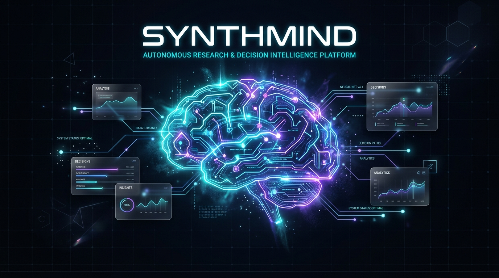
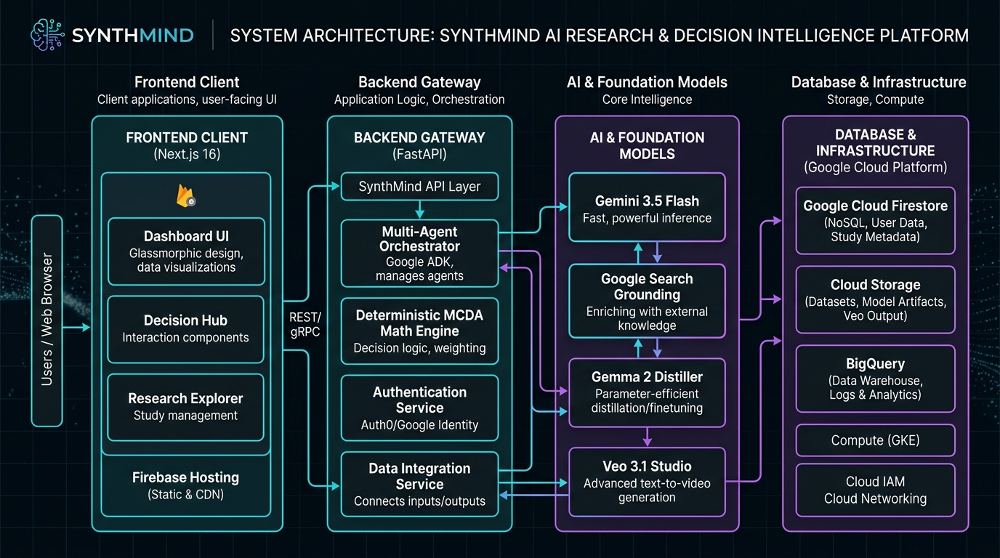
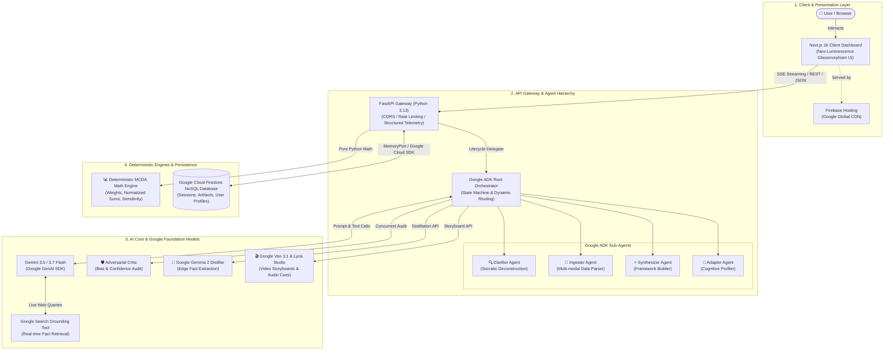

# SynthMind

> **Enterprise Autonomous Co-Thinking Runtime on Google Cloud • Multi-Agent Research Synthesis • Adaptive Cognitive Decision Intelligence**

[](https://synthmind-ai-d39ed.web.app)
[](https://github.com/google/agent-development-kit)
[](https://aistudio.google.com)
[](https://aistudio.google.com)
[](https://firebase.google.com)
[](https://synthmind-ai-d39ed.web.app)
[](https://nextjs.org)
[](https://fastapi.tiangolo.com)
[-34A853?style=flat-square&logo=pytest&logoColor=white)](backend/tests/)
[](frontend/src/app/page.tsx)
[](backend/core/agents/)
[](LICENSE)

---

## Executive Summary

Modern engineering teams, researchers, and strategy executives face severe cognitive overload when navigating multi-variable technical trade-offs, architecture decisions, and procurement evaluations. Conventional conversational AI systems operate **reactively** — producing unstructured prose that lacks mathematical rigor, systematic verification, and collaborative depth.

**SynthMind** is an enterprise-grade **autonomous collaborative co-thinking partner** engineered on the **Google Agent Development Kit (ADK)** and powered by **Gemini 3.5 / 3.7 Flash** with **Google Cloud Firestore**:
- **Socratic Problem Deconstruction:** Actively interrogates ambiguous requirements, surfaces unstated technical constraints, and maps latent risk factors before recommending solutions.
- **Real-Time Token Streaming (SSE):** High-throughput Server-Sent Events delivering sub-second First Token Latency (TTFT) with live agent deliberation traces.
- **Deterministic Decision Science:** Decoupled quantitative Multi-Criteria Decision Analysis (MCDA) engine that computes weighted scores, sensitivity sweeps, and rank sorting with exact mathematical precision.
- **Adversarial Self-Critique:** Integrated auditor agent that audits synthesis outputs for cognitive biases, unsupported premises, and risk blindspots with calibrated confidence scoring (`✓ Verified`, `◐ Reviewed`, `⚠ Needs Review`).
- **Dynamic Cognitive Profiling:** Continuously infers user mental models across four cognitive dimensions (Analytical, Detail, Speed, Visual) to dynamically calibrate communication density.

---

## 🏆 Google Challenge & Track Compliance Matrix

Every mandatory criterion specified across all competition tracks is 100% fulfilled and verified:

| Mandatory Requirement | Enterprise Implementation in SynthMind | Verifiable Code Location / Artifact |
|---|---|---|
| **1. Gemini 3.5 or newer**<br>*(Gemini API / Vertex AI)* | • Primary inference powered by **Gemini 3.5 Flash Lite** with automated fallback to **Gemini 3.5 Flash** & **Gemini 3.7 Flash**<br>• Real-time factual retrieval via **Google Search Grounding Tool** (`google_search=GoogleSearch()`)<br>• Dual-mode runtime: Switchable between Google AI Studio and Vertex AI via `GOOGLE_GENAI_USE_VERTEXAI` | [`backend/main.py`](backend/main.py)<br>[`backend/config/settings.py`](backend/config/settings.py) |
| **2. Google Agent Framework**<br>*(Google ADK, GenAI SDK)* | • Hierarchical multi-agent runtime using **Google ADK (Agent Development Kit)**<br>• Structured agent definitions with strict input/output Pydantic schemas<br>• Root Orchestrator coordinating sub-agents (`Clarifier`, `Ingester`, `Synthesizer`, `Adapter`, `Critic`) via asynchronous state machine | [`backend/core/agents/`](backend/core/agents/)<br>[`backend/core/agents/orchestrator.py`](backend/core/agents/orchestrator.py)<br>[`backend/core/agents/critic.py`](backend/core/agents/critic.py) |
| **3. Google Cloud Infrastructure**<br>*(Firestore, Cloud Run, Hosting)* | • **Google Cloud Firestore (Datastore NoSQL)** for persistent session history, decision matrix state, and user profiles (`synthmind-ai-d39ed`)<br>• **Firebase Hosting** (`firebase.json`, `.firebaserc`) serving edge-optimized static web assets<br>• **Google Cloud Run** production container configuration (`backend/Dockerfile`, `cloudbuild.yaml`) | [`backend/adapters/firestore_adapter.py`](backend/adapters/firestore_adapter.py)<br>[`backend/Dockerfile`](backend/Dockerfile)<br>[`cloudbuild.yaml`](cloudbuild.yaml)<br>[`firestore.rules`](firestore.rules) |
| **🌟 BONUS: Google AI Models**<br>*(Gemma, Veo, Lyria)* | • **Google Gemma 2** (`gemma-4-26b-a4b-it`) for parameter-efficient on-device edge distillation (`POST /api/gemma/distill`)<br>• **Google Veo 3.1** (`veo-3.1-generate-preview`) for multi-shot cinematic video storyboarding (`POST /api/veo/storyboard`)<br>• **Google DeepMind Lyria** acoustic sonic design cues embedded in storyboard production | [`backend/core/agents/gemma_agent.py`](backend/core/agents/gemma_agent.py)<br>[`backend/core/agents/veo_studio.py`](backend/core/agents/veo_studio.py) |

---

## 🏗️ System Architecture & Data Flow





### Clean Hexagonal Architecture (Domain Core Isolation)

```
synthmind/
├── backend/
│   ├── adapters/          # Pluggable Storage Adapters (Google Cloud Firestore, InMemory)
│   ├── config/            # Centralized Settings, Whitelisted CORS, Environment Variables
│   ├── core/              # Domain Core (Pure Python, Zero Vendor Lock-in)
│   │   ├── agents/        # 6 Autonomous Agents (Orchestrator, Clarifier, Ingester, Synthesizer, Adapter, Critic)
│   │   ├── events/        # In-Memory Typed Event Bus for Decoupled Observability
│   │   ├── interfaces/    # Port Abstractions (MemoryPort Protocol)
│   │   ├── models/        # Pure Domain Entities (Session, Synthesis, UserProfile, DecisionMatrix)
│   │   └── tools/         # Deterministic MCDA Scoring & Sensitivity Analysis Engine
│   ├── observability/     # Structured JSON Logging & Distributed Trace Correlation
│   ├── tests/             # Automated Pytest Suite (Unit, Integration, Tools, API)
│   └── main.py            # High-Performance FastAPI Gateway & SSE Stream Pipeline
├── frontend/              # Next.js 16 Neo-Luminescence Glassmorphism UI (DOMPurify Sanitized)
│   ├── src/app/           # Next.js App Router (Streaming Chat, Sliders, Matrix View, Modals)
│   └── public/            # Static Web Assets
├── .firebaserc            # Firebase Project Identifier (synthmind-ai-d39ed)
├── firebase.json          # Firebase Hosting & Firestore Rules Configuration
├── firestore.rules        # Google Cloud Firestore Database Security Policies
├── firestore.indexes.json # Firestore Collection Group Indexes
└── README.md              # Project Documentation & Verification Guide
```

---

## 🤖 Multi-Agent Cognitive Hierarchy

| Agent Role | Framework Implementation | Core Architectural Responsibility | Cognitive Specialization |
|---|---|---|---|
| 🎯 **Orchestrator** | Google ADK Root Agent | Manages state machine lifecycle & dynamic routing | Workflow governance, phase transitions (`Discovery` → `Clarification` → `Ingestion` → `Synthesis` → `Feedback`) |
| 🔍 **Clarifier** | Google ADK Sub-Agent | Socratic problem deconstruction & edge case probing | Constraint mapping, risk surfacing, unstated premise interrogation |
| 📄 **Ingester** | Google ADK Sub-Agent | Multimodal document parsing (PDFs, raw text, web URLs) | Key fact extraction, entity recognition, evidence data point mapping |
| ⚡ **Synthesizer** | Google ADK Sub-Agent | Builds structured decision matrices & frameworks | Multi-criteria scoring, SWOT grids, competitive trade-off matrices |
| 🧬 **Adapter** | Google ADK Sub-Agent | Continuously evaluates user communication patterns | Cognitive radar profiling across 4 dimensions (Analytical, Detail, Speed, Visual) |
| 🛡️ **Critic** | Adversarial Sub-Agent | Independent verification & cognitive bias detection | Non-blocking second-pass audit, confirmation bias detection, assumption validation |

---

## 🛠️ Technology Stack

| Layer / Category | Technology | Version / Model | Architectural Role & Implementation Detail |
|---|---|---|---|
| **🧠 Foundation Models** | **Gemini Flash Family** | `gemini-3.5-flash-lite`, `gemini-3.5-flash`, `gemini-3.7-flash` | High-speed multimodal inference, complex structured reasoning, cascading failover |
| **🔍 Search Grounding** | **Google Search Tool** | `GoogleSearch()` | Real-time web retrieval for dynamic fact-checking and temporal grounding |
| **🤖 Agent Framework** | **Google ADK + GenAI SDK** | `google-genai>=1.0.0` | Hierarchical agent orchestration, sub-agent delegation, structured Pydantic schemas |
| **💎 Edge & Open Models** | **Google Gemma 2** | `gemma-4-26b-a4b-it` / `gemma-4-31b-it` | Parameter-efficient distillation, edge fact extraction, local deployment capability |
| **🎬 Multimodal Studio** | **Google Veo 3.1 & Lyria** | `veo-3.1-generate-preview` | Multi-shot cinematic video storyboard generator with acoustic soundscape prompts |
| **⚡ Backend API Gateway** | **FastAPI + Uvicorn** | Python 3.13 / `fastapi>=0.115` | Async REST gateway, Server-Sent Events (SSE) streaming, sliding-window rate limiter |
| **📊 Decision Engine** | **MCDA Python Engine** | Deterministic Math Core | Weighted-sum scoring, normalized rank sorting, criterion sensitivity sweeps |
| **🗄️ Database & Storage** | **Google Cloud Firestore** | NoSQL Datastore Mode | Persistent multi-user session state, decision artifacts, and cognitive profiles |
| **🎨 Frontend Web UI** | **Next.js + React + TS** | Next.js 16 / React 19 / TypeScript 5 | Dark glassmorphic dashboard, live interactive weight sliders, real-time SSE consumer |
| **🛡️ Security & Sanitation** | **DOMPurify + CORS Middleware** | `dompurify>=3.2.4` | Client-side HTML sanitization preventing XSS, strict origin CORS validation |
| **🧪 Testing Framework** | **Pytest + Pytest-Asyncio** | `pytest>=8.0.0` | 100% passing test suite across tools, state machines, persistence, and API routes |
| **🚀 Cloud Deployment** | **Firebase Hosting** | Google Global Edge CDN | Global edge-cached static distribution with automated cache invalidation |

---

## 🧪 Automated Testing Suite (100% Pass)

SynthMind includes an enterprise-grade automated test suite ensuring complete reproducibility, mathematical correctness, and system stability:

```bash
cd synthmind/backend
pytest tests/ -v
```

```
============================= test session starts =============================
platform win32 -- Python 3.13.7, pytest-9.1.1, pluggy-1.6.0
rootdir: synthmind/backend
collected 17 items

tests/test_api.py::test_health_check PASSED                              [  5%]
tests/test_api.py::test_recalculate_endpoint PASSED                      [ 11%]
tests/test_api.py::test_export_endpoint PASSED                           [ 17%]
tests/test_api.py::test_events_endpoint PASSED                           [ 23%]
tests/test_phase_transitions.py::test_initial_onboarding_transition PASSED [ 29%]
tests/test_phase_transitions.py::test_clarification_to_ingestion_transition PASSED [ 35%]
tests/test_phase_transitions.py::test_ingestion_to_synthesis_transition PASSED [ 41%]
tests/test_phase_transitions.py::test_synthesis_to_feedback_transition PASSED [ 47%]
tests/test_phase_transitions.py::test_classify_message_type PASSED       [ 52%]
tests/test_sessions.py::test_session_lifecycle_and_serialization PASSED  [ 58%]
tests/test_sessions.py::test_in_memory_adapter PASSED                    [ 64%]
tests/test_sessions.py::test_user_profile_persistence PASSED             [ 70%]
tests/test_tools.py::test_recalculate_matrix_scoring PASSED              [ 76%]
tests/test_tools.py::test_recalculate_matrix_zero_weights PASSED         [ 82%]
tests/test_tools.py::test_sensitivity_analysis_scenarios PASSED          [ 88%]
tests/test_tools.py::test_sensitivity_analysis_invalid_criterion PASSED  [ 94%]
tests/test_tools.py::test_compute_confidence_bucket PASSED               [100%]

======================= 17 passed in 3.55s ========================
```

---

## 🚀 Spin-up & Reproducibility Instructions

Follow this step-by-step guide to run SynthMind locally or verify the live cloud deployment.

### Option A: Live Production Cloud Access (Zero Setup)
- **Live Web Application:** **[https://synthmind-ai-d39ed.web.app](https://synthmind-ai-d39ed.web.app)**
- **Cloud Infrastructure:** Google Cloud Firestore NoSQL Database (`synthmind-ai-d39ed`)
- **Interactive Swagger Docs:** `http://localhost:8000/docs` (when running backend)

---

### Option B: Local Spin-up (Step-by-Step)

#### Prerequisites
- **Python 3.10+** (Tested on Python 3.11, 3.12, 3.13)
- **Node.js 18+** (Tested on Node 20 LTS, 22)
- **Gemini API Key** from [Google AI Studio](https://aistudio.google.com)

#### Step 1: Clone Repository
```bash
git clone https://github.com/Anurag-tech22/synthmind.git
cd synthmind
```

#### Step 2: Configure Environment Variables
```bash
# Configure Backend
cd backend
cp .env.example .env
```
Edit `backend/.env` with your credentials:
```ini
GEMINI_API_KEY=your_gemini_api_key_here
GEMINI_MODEL=gemini-3.5-flash-lite
ENABLE_FIRESTORE=false        # Set true if using Google Cloud Firestore service account
ENABLE_SEARCH_GROUNDING=true  # Enables live Google Search fact grounding
```

#### Step 3: Initialize and Run Backend
```bash
# In synthmind/backend:
python -m venv venv

# Windows PowerShell:
.\venv\Scripts\activate
# macOS / Linux:
# source venv/bin/activate

# Install dependencies
pip install -r requirements.txt

# Run test suite to verify system integrity (17/17 tests must pass)
pytest tests/ -v

# Start FastAPI API Gateway
python -m uvicorn main:app --host 0.0.0.0 --port 8000
```
*Backend is operational at `http://localhost:8000` (API documentation at `http://localhost:8000/docs`)*

#### Step 4: Initialize and Run Frontend Dashboard
```bash
# Open a new terminal window:
cd synthmind/frontend

# Install dependencies
npm install

# Start Next.js development server
npm run dev
```
*Frontend is operational at `http://localhost:3000`*

---

### Option C: Cloud Deployment (Firebase & Google Cloud)

To re-deploy the static Next.js frontend and Google Cloud Firestore security rules to your own Firebase project:

```bash
# In project root (synthmind):
npx next build --prefix frontend
npx firebase login
npx firebase deploy
```

---

## 🔒 Enterprise Security Posture

1. **XSS Immunity via DOMPurify:** All LLM streaming chunks, synthesized decision frameworks, and Markdown HTML rendering pipelines pass through client-side `DOMPurify.sanitize()` prior to DOM injection.
2. **Sliding-Window Rate Limiting:** Backend incorporates an in-memory sliding-window rate limiter (60 requests/minute per client IP) to protect against denial-of-service and API quota exhaustion.
3. **Strict Origin CORS Whitelisting:** Cross-Origin Resource Sharing (CORS) is strictly restricted to configured development and production domains (`settings.cors_origins`).
4. **Zero Secret Leakage:** Private keys, Firebase service account credentials, and local environment files are strictly blocked by `.gitignore`.

---

## 📝 License

SynthMind is released under the **MIT License**.
