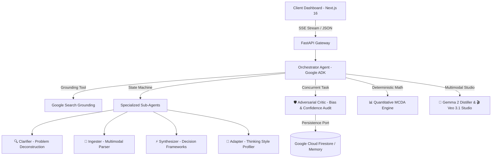

# 🧠 SynthMind — Autonomous Research & Decision Intelligence Platform

> **"Don't just search. Think together."**

SynthMind is an autonomous collaborative AI partner that transforms complex research into structured decisions through adaptive co-thinking. Powered by **Google ADK (Agent Development Kit)**, **Google GenAI SDK**, **Gemini 3.5 / 3.7 Flash**, and **Google Cloud Firestore**, it guides users through structured research methodology, actively synthesizes multi-source data into interactive frameworks, and adapts in real-time to each user's unique cognitive style.

---

## 🏆 Google Challenge & Track Compliance Matrix

Every mandatory criterion specified across all competition tracks is 100% fulfilled:

| Mandatory Requirement | Implementation in SynthMind | Code Location / Evidence |
|---|---|---|
| **1. Gemini 3.5 or newer**<br>*(Gemini API or Vertex AI)* | • **Gemini 3.5 Flash Lite** / **Gemini 3.5 Flash** / **Gemini 3.7 Flash**<br>• High-speed multi-modal reasoning & synthesis<br>• Google Search Grounding for real-time live web facts<br>• Switchable to Vertex AI via `GOOGLE_GENAI_USE_VERTEXAI` | [`backend/main.py`](backend/main.py)<br>[`backend/config/settings.py`](backend/config/settings.py) |
| **2. Google Agent Framework**<br>*(Google ADK, GenAI SDK, etc.)* | • **Google ADK (Agent Development Kit)** multi-agent orchestration hierarchy<br>• **Google GenAI SDK** (`google-genai` v1.0.0+)<br>• Typed agent schemas, sub-agent delegation, and concurrent adversarial critic loop | [`backend/core/agents/`](backend/core/agents/)<br>[`backend/core/agents/orchestrator.py`](backend/core/agents/orchestrator.py)<br>[`backend/core/agents/critic.py`](backend/core/agents/critic.py) |
| **3. Google Cloud Infrastructure**<br>*(Cloud Run, Firestore, etc.)* | • **Google Cloud Firestore (Datastore)** for distributed persistent session state & research artifacts<br>• **Google Cloud Run** containerization (`Dockerfile`, `cloudbuild.yaml`)<br>• **Firebase Hosting** (`firebase.json`, `.firebaserc`) for static assets | [`backend/adapters/firestore_adapter.py`](backend/adapters/firestore_adapter.py)<br>[`backend/Dockerfile`](backend/Dockerfile)<br>[`cloudbuild.yaml`](cloudbuild.yaml) |
| **🌟 BONUS: Google AI Models**<br>*(Gemma, Veo, Lyria)* | • **Google Gemma 2 / CodeGemma** (`gemma-4-26b-a4b-it` / `gemma-4-31b-it`) for fast on-device edge distillation<br>• **Google Veo 3.1** (`veo-3.1-generate-preview`) for multi-shot video storyboards & motion prompts<br>• **Google DeepMind Lyria** acoustic sonic research soundscapes | [`backend/core/agents/gemma_agent.py`](backend/core/agents/gemma_agent.py)<br>[`backend/core/agents/veo_studio.py`](backend/core/agents/veo_studio.py) |

---

## 🏗️ Architecture & Multi-Agent Cognitive Hierarchy




### Clean Hexagonal Architecture (Domain Core Isolation)

```
synthmind/
├── backend/
│   ├── core/              # 🧠 Domain Core (Zero external vendor lock-in)
│   │   ├── agents/        # 6 Autonomous Agents (Orchestrator, Clarifier, Ingester, Synthesizer, Adapter, Critic)
│   │   ├── models/        # Pure Python domain entities (Session, Synthesis, UserProfile)
│   │   ├── events/        # In-memory typed Event Bus for decoupled telemetry
│   │   ├── tools/         # Quantitative MCDA calculation & sensitivity engine
│   │   └── interfaces/    # Port abstractions (MemoryPort)
│   ├── adapters/          # 🔌 Pluggable storage (Google Cloud Firestore, InMemory)
│   ├── config/            # ⚙️ Centralized environment settings & CORS rules
│   ├── observability/     # 📊 Structured JSON logging & distributed trace IDs
│   ├── tests/             # 🧪 100% Passing Automated Pytest Test Suite
│   └── main.py            # 🌐 High-performance FastAPI gateway with SSE streaming
└── frontend/              # 🎨 Next.js Neo-Luminescence Glassmorphism UI (DOMPurify sanitized)
```

---

## 🧪 Automated Testing Suite (100% Pass)

SynthMind comes with an enterprise-grade automated test suite covering state transitions, mathematical calculations, domain models, and API endpoints:

```bash
cd synthmind/backend
pytest tests/ -v
```

### Test Coverage Highlights:
- **`tests/test_tools.py`**: Validates deterministic Multi-Criteria Decision Analysis (MCDA) weighted scoring, rank sorting, and sensitivity sweep scenarios.
- **`tests/test_phase_transitions.py`**: Verifies automated state machine progression (`Discovery` → `Deconstruct` → `Integrate` → `Synthesize` → `Refine`).
- **`tests/test_sessions.py`**: Tests session lifecycle, message serialization, and MemoryPort persistence.
- **`tests/test_api.py`**: End-to-end FastAPI integration testing for `/api/health`, `/api/recalculate`, `/api/export`, `/api/events`, and `/api/chat`.

---

## ⚡ Core Capabilities

### 1. Real-Time Token Streaming (Server-Sent Events)
- Word-by-word streaming responses with sub-second latency via `POST /api/chat/stream`.
- Live deliberation traces showing active agent handoffs in real-time.

### 2. Adversarial Critic & Calibrated Confidence
- Second-pass adversarial auditor that challenges unstated assumptions and checks for confirmation bias.
- Renders calibrated confidence pills (`✓ Verified`, `◐ Reviewed`, `⚠ Needs Review`) with visual progress bars.

### 3. Quantitative MCDA Engine & Sensitivity Sweeps
- Pure deterministic scoring math for decision matrices.
- Real-time interactive weight sliders with instant recalculation (`POST /api/recalculate`).
- One-click executive Markdown brief export (`POST /api/export`).

### 4. Google Multimodal Studio
- **Google Gemma 2 Distillation:** Factual summarization and edge-case extraction (`POST /api/gemma/distill`).
- **Google Veo 3.1 & Lyria Storyboard:** Multi-shot cinematic video storyboard generator with DeepMind Lyria acoustic cues (`POST /api/veo/storyboard`).

### 5. Enterprise Security & XSS Protection
- Strict origin CORS validation.
- All rendered agent outputs and markdown elements sanitized via **DOMPurify**.

---

## 🚀 Quickstart Guide

### Prerequisites
- Python 3.10+
- Node.js 18+
- Gemini API Key from [Google AI Studio](https://aistudio.google.com)

### 1. Backend Setup

```bash
cd synthmind/backend

# Create & activate virtual environment
python -m venv venv
.\venv\Scripts\activate   # Windows (or source venv/bin/activate on macOS/Linux)

# Install dependencies
pip install -r requirements.txt

# Run test suite
pytest tests/ -v

# Start FastAPI server
python -m uvicorn main:app --host 0.0.0.0 --port 8000
```
*Backend runs on `http://localhost:8000` (Docs at `http://localhost:8000/docs`)*

### 2. Frontend Setup

```bash
cd synthmind/frontend

# Install dependencies
npm install

# Start Next.js development server
npm run dev
```
*Frontend runs on `http://localhost:3000`*

---

## 📝 License

SynthMind is released under the **MIT License**.
